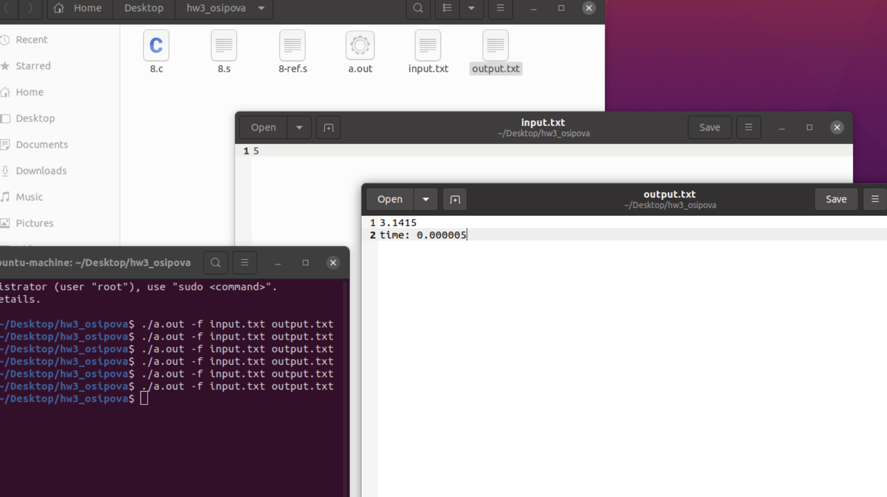

# HW_3
## Осипова Елизавета - БПИ219 - Вариант 21

### Задание - 21 вариант:
Разработать программу вычисления числа π с точностью не хуже 0,05% посредством ряда Нилаканта.

### На 4 балла:
Решение на 4 балла на C содержится в файле на 8 баллов - [8.c](8.c)
Программа на ассемблере на 4 балла с соответстующими комментариями - [8.s](8.s)

```
gcc -masm=intel -fno-asynchronous-unwind-tables -fno-jump-tables -fno-stack-protector -fno-exceptions -S code-on-c.c
```

Тесты и результаты 


### На 5 баллов:
Решение на 5 баллов на C содержится в файле на 8 баллов - [8.c](8.c)
Программа на ассемблере на 5 баллов с соответстующими комментариями - [8.s](8.s)

void print_f(FILE * out, double pi, int N, double t) - вывод числа π

double pi_N() - число π в зависимотсти от N

### На 6 баллов:
Решение на 6 баллов на C содержится в файле на 8 баллов - [8.c](8.c)
Программа на ассемблере на 6 баллов с соответстующими комментариями - [8.s](8.s)

Код программы был разделён на файлы. (В папке "6 баллов"")
pi_N.s - первый файл (pi_N.с)
print_f.s - второй файл (print_f.с)
8.s - третий файл (8.с)

Представлено полное тестовое покрытие, дающее одинаковый результат на обоих программах.
Приведены результаты тестовых прогонов для всех трех программ, демонстрирующие эквивалентность функционирования.


Реализована проверка ввода:


### На 7 баллов:

В программу добавлены ввод данных из файла и вывод результатов в файл:

[input.txt](input.txt) - файл с входными данными

[output.txt](output.txt) - файл с выходными данными

Файлы для тестов:

[input-1.txt](input-1.txt)

[input-2.txt](input-2.txt)

[input-3.txt](input-3.txt)

[input-4.txt](input-4.txt)

[input-5.txt](input-5.txt)


Разделение на файлы представленно в папке "6 баллов". 

### На 8 баллов:

ВАЖНО: Код программы на 8 баллов полностью удовлетворяет критериям на 4-7.  

Тесты и результаты:
<br></br>

Решение на 8 баллов на С после рефакторинга, для проведения сравнения на производительность - [8-ref.s](8-ref.s) 
Добавлены замеры во времени, которые не учитывают время ввода и вывода данных. 

```
  fprintf(out, "\ntime: %.6lf\n", t);
```

ключ -h help (вывод всех ключей с обозначениями) 

ключ -f input.txt output.txt (ввод из входного файла и запись результата в выходной файл) 

ключ -r output.txt (генерируется рандомное число N)  

ключ -s (ввод из командной строки)  


Тесты и результаты:
<br></br>
<br></br>
<br></br>
<br></br>
<br></br>
<br></br>
<br></br>
<br></br>
<br></br>
<br></br>

### На 9 баллов:
</br>


